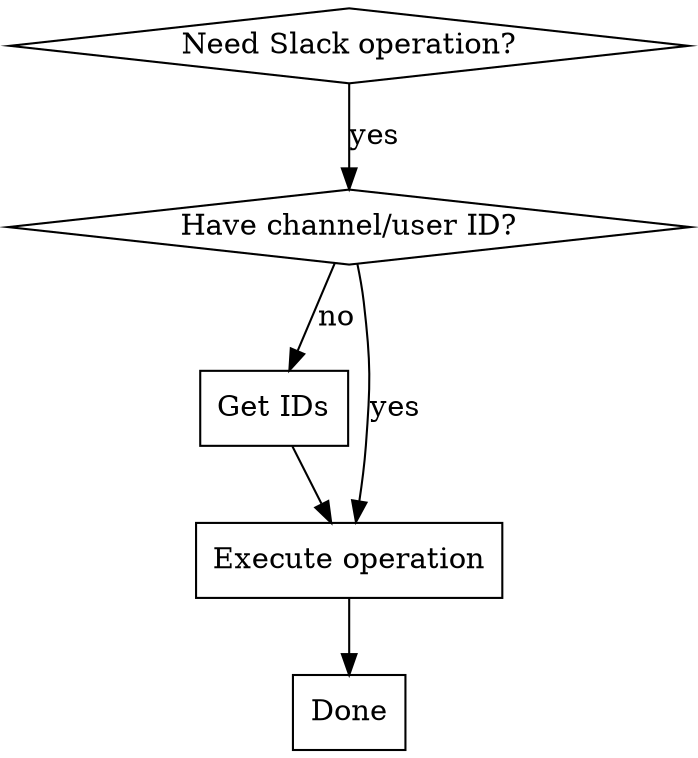

# Slack Operations from Claude Code

## Overview

Use your Slack workspace directly as a puppet. No MCP needed. Execute Slack operations (read messages, send, search, list channels/users) via the helper script using your bot token.

**Core principle:** Get IDs first, execute operations second. Slack APIs require channel IDs (like `C123...`) and user IDs (like `U123...`), not names.

## When to Use

**Use when:**
- Reading messages from channels
- Sending messages to channels or users
- Searching workspace for content
- Listing channels or users
- Getting channel information
- Reacting to messages
- Managing threads

**Have ready:**
- Bot token in `.claude/slack-config.json`
- Helper script at `.claude/slack-helper.sh`
- Channel ID or user ID (get via `list-channels` or `list-users` first)

## The Three-Step Pattern



## Quick Reference

| Operation | Command | Example |
|-----------|---------|---------|
| **Test auth** | `slack test` | Verify bot token works |
| **List channels** | `slack list-channels` | Find channel IDs |
| **List users** | `slack list-users` | Find user IDs |
| **Send message** | `slack send-message <ID> <text>` | `slack send-message C123 "hello"` |
| **Get messages** | `slack get-messages <ID> [limit]` | `slack get-messages C123 50` |
| **Channel info** | `slack channel-info <ID>` | Get metadata, members |
| **Search** | `slack search <query>` | `slack search "bug report"` |

## Implementation: The Helper Script

Your helper script is at `.claude/slack-helper.sh`. It wraps Slack API calls and handles token loading automatically.

**Setup (one-time):**
```bash
chmod +x .claude/slack-helper.sh
```

**Usage:**
```bash
./.claude/slack-helper.sh <command> [args]
```

## Common Operations

### 1. Send a Message to a Channel

```bash
# Step 1: List channels to find the ID
./.claude/slack-helper.sh list-channels | grep "channel-name"
# Output: C0170ESN2R4 | general-en (members: 67)

# Step 2: Send message
./.claude/slack-helper.sh send-message C0170ESN2R4 "Hello Slack!"
# Output: ✅ Message sent!
```

### 2. Read Recent Messages from a Channel

```bash
# Get last 20 messages
./.claude/slack-helper.sh get-messages C0170ESN2R4 20

# Output: timestamps, user IDs, and message text
```

### 3. Send a Direct Message

```bash
# Step 1: List users to find the user ID
./.claude/slack-helper.sh list-users | grep "username"
# Output: U123456789 | username (Real Name)

# Step 2: Send DM
./.claude/slack-helper.sh send-message U123456789 "Direct message"
```

### 4. Search Messages

```bash
./.claude/slack-helper.sh search "bug report"

# Returns matching messages with context
```

### 5. Get Channel Information

```bash
./.claude/slack-helper.sh channel-info C0170ESN2R4

# Output: channel ID, name, topic, member count, creation date
```

## Direct API Calls (When Needed)

If you need something not in the helper script, use the Slack REST API directly:

```bash
# Load token
BOT_TOKEN=$(jq -r '.botToken' .claude/slack-config.json)

# Example: Post message
curl -s -X POST https://slack.com/api/chat.postMessage \
  -H "Authorization: Bearer ${BOT_TOKEN}" \
  -d "channel=C123&text=Hello"

# Example: Get channel history
curl -s https://slack.com/api/conversations.history \
  -H "Authorization: Bearer ${BOT_TOKEN}" \
  -d "channel=C123&limit=50"
```

**See `.claude/SLACK-API-GUIDE.md` for complete API reference.**

## Key Facts to Remember

1. **IDs Not Names:** Always use channel IDs (C123...) and user IDs (U123...), not names
2. **Get IDs First:** Always list channels/users before operating - this is the pattern
3. **Token Management:** The helper script loads your token automatically from `.claude/slack-config.json`
4. **Timestamps:** Message timestamps are like `1234567890.123456` (seconds.microseconds)
5. **Rate Limits:** Slack has ~20 requests/minute - stagger requests for batch operations

## Common Mistakes

| Mistake | Why It Fails | Fix |
|---------|-------------|-----|
| Using channel name instead of ID | Slack APIs require IDs, not names | Always `list-channels` first to find ID |
| Running operation without ID | Missing required parameter | Get ID (C123/U123) before executing |
| Forgetting to test auth | Won't know if token works | Run `.slack test` first |
| Not parsing helper output | Can't find the ID you need | Pipe to `grep` to find channel: `list-channels \| grep name` |
| Sending long messages unquoted | Shell interprets special characters | Quote messages: `send-message C123 "Hello \"world\""` |

## Workflow Tips

**For batch operations:**
```bash
# Store IDs in variables for reuse
GENERAL_ID=$(./slack-helper.sh list-channels | grep "general-en" | awk '{print $1}')
DEV_ID=$(./slack-helper.sh list-channels | grep "dev-" | awk '{print $1}')

# Reuse without re-listing
./.claude/slack-helper.sh send-message "${GENERAL_ID}" "Message 1"
./.claude/slack-helper.sh send-message "${DEV_ID}" "Message 2"
```

**For reading conversations:**
```bash
# Get recent messages and store
MESSAGES=$(./.claude/slack-helper.sh get-messages C123 50)
echo "$MESSAGES" | grep -i "keyword"
```

**For searching:**
```bash
# Search and parse results
./.claude/slack-helper.sh search "error" | jq '.matches'
```

## Integration Example

Typical workflow in a script:

```bash
#!/bin/bash
set -e

SLACK_HELPER="./.claude/slack-helper.sh"

# Step 1: Authenticate
$SLACK_HELPER test

# Step 2: Get channel IDs
GENERAL=$(./slack-helper.sh list-channels | grep "general-en" | awk '{print $1}')

# Step 3: Execute operations
$SLACK_HELPER send-message "$GENERAL" "Deployment starting..."
$SLACK_HELPER get-messages "$GENERAL" 5

echo "✅ Slack operations complete"
```

## Authorization & Security

- **Token:** Stored in `.claude/slack-config.json` with permissions 600 (owner only)
- **File ignored:** `.gitignore` prevents accidental credential commits
- **Helper loads automatically:** No manual token passing needed
- **Environment variable:** Can override with `export SLACK_BOT_TOKEN=...` if needed

## Red Flags - STOP Before Continuing

- ❌ Operating without testing auth first (`slack test`)
- ❌ Using channel names instead of IDs
- ❌ Skipping `list-channels`/`list-users` to get IDs
- ❌ Assuming channel names are consistent (they change, IDs don't)

**All of these mean: Step back and get IDs first.**

## Reference: All Available Commands

**Auth & Discovery:**
- `slack test` - Verify token works
- `slack list-channels` - Get all channel IDs and names
- `slack list-users` - Get all user IDs and names
- `slack channel-info <ID>` - Get metadata about a channel

**Messages:**
- `slack send-message <ID> <text>` - Send to channel or user
- `slack get-messages <ID> [limit]` - Read message history (default 20, max 100)
- `slack search <query>` - Search all messages

**Full API Reference:** See `.claude/SLACK-API-GUIDE.md`
